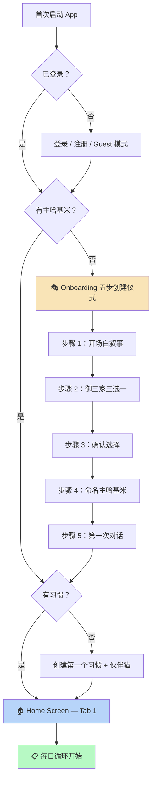
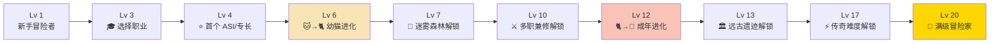
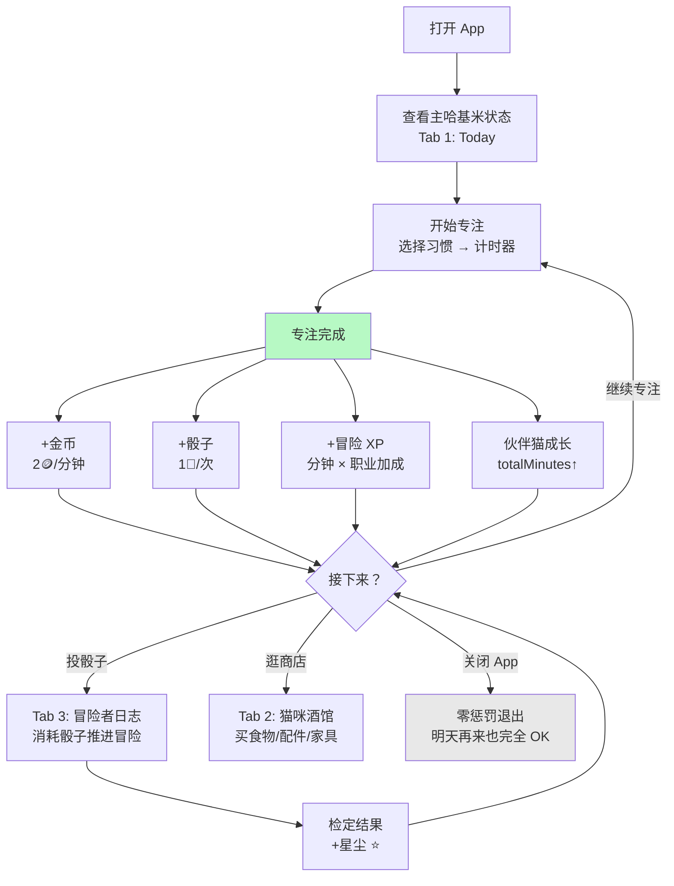
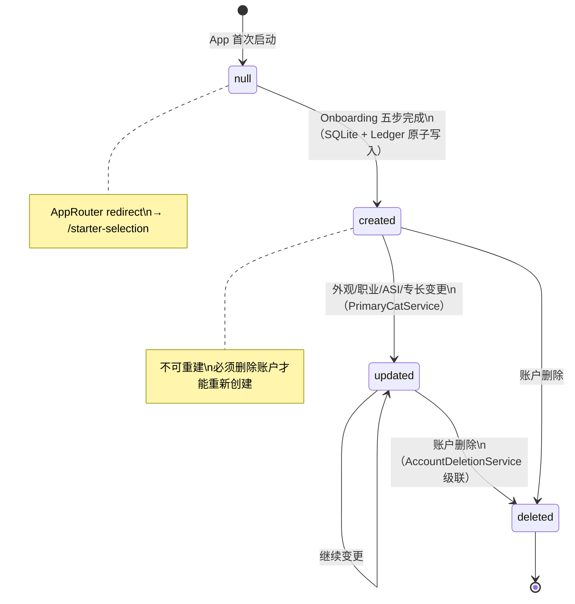
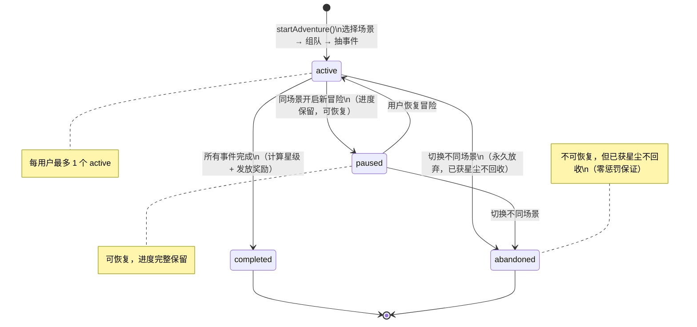
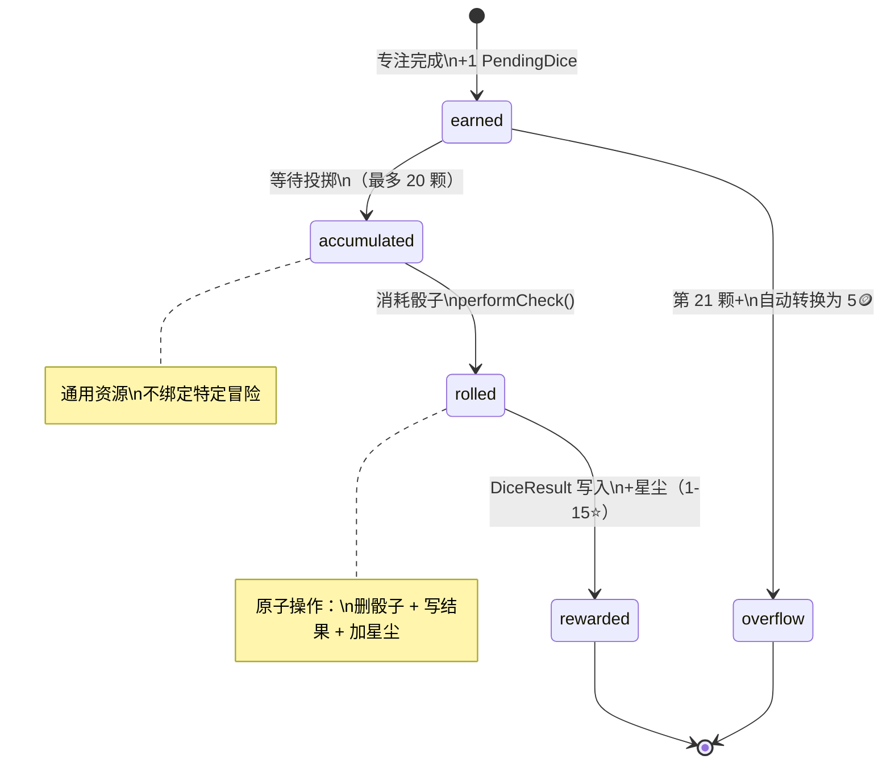
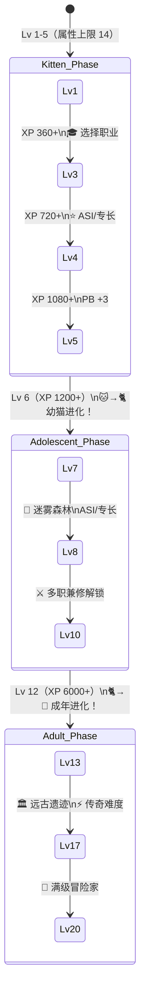

# Hachimi v2.0 — 用户体验地图

> **Status:** Active
> **Purpose:** 定义产品定位、用户旅程和交互流程，作为所有设计文档的体验锚点。
> **Related:** [README.md](../README.md) · [spec/01-primary-cat.md](../spec/01-primary-cat.md) · [spec/04-adventure.md](../spec/04-adventure.md)
> **Changelog:**
> - 2026-03-15 — 初版（编码前审计产出）

---

## 1. 产品定位

### 一句话定义

**Hachimi 是一款将 DnD 桌游叙事融入习惯养成的猫咪陪伴 App——每一次专注都化为骰子，每一颗骰子都推进你的冒险故事。**

### 核心价值主张

| 维度 | 价值 |
|------|------|
| 情感锚点 | 主哈基米是"你的 RPG 化身"，伙伴猫是"你的每个习惯的化身"——用户照顾猫咪 = 照顾自己 |
| 成长可视化 | 6 维 DnD 属性（STR/DEX/CON/INT/WIS/CHA）将抽象的习惯坚持转化为可感知的角色成长 |
| 叙事驱动力 | 冒险场景卡提供"下一章会发生什么"的好奇心——习惯不再是义务，而是推进故事的燃料 |
| 零惩罚承诺 | 不打开 App 不会有任何负面后果，失败的骰子检定仍有奖励，猫咪永远不会死亡 |

### 竞品差异化

| 竞品 | 核心机制 | Hachimi 差异 |
|------|---------|-------------|
| **Finch**（$900K-2M/月） | 单一宠物鸟 + 日记 + 每日探索 | 多猫组队 + DnD 深度 + 骰子随机性叙事 |
| **Habitica** | HP 惩罚 + RPG 任务 | **零惩罚** + 猫咪情感投射 + 单人自我关怀 |
| **Forest** | 种树 + 专注计时 | 更丰富的角色成长反馈 + 冒险叙事层 |
| **Neko Atsume** | 放置收集 + 零压力 | 增加主动成长目标 + 习惯绑定机制 |

---

## 2. 用户全生命周期旅程

### 2.1 首次启动到日常使用



### 2.2 成长里程碑时间线



---

## 3. 日常循环

### 3.1 每日核心循环



### 3.2 每日经济预估

| 用户类型 | 专注时长 | 金币收入 | 骰子获取 | 星尘收入 |
|---------|---------|---------|---------|---------|
| 轻度（25 分钟） | 1 次 | ~80🪙 | 1🎲 | ~6.5⭐ |
| 中度（75 分钟） | 2-3 次 | ~200🪙 | 2-3🎲 | ~13-20⭐ |
| 重度（125 分钟） | 3-5 次 | ~280🪙 | 3-5🎲 | ~20-33⭐ |

### 3.3 每周成长循环

```
周一-周五：专注 → 积累骰子 → 推进冒险 → 属性缓慢提升
周末：回顾属性雷达图 → 冲刺未完成场景 → 解锁新难度
月度：猫咪进化里程碑 → 新区域解锁 → 职业/专长选择
```

---

## 4. 屏幕清单

### 4.1 Tab 结构（3 Tab）

| Tab | 名称 | 核心职责 |
|-----|------|---------|
| Tab 1 | Today | 习惯列表 + 专注入口 + 主哈基米状态 |
| Tab 2 | 猫咪酒馆 | 猫咪互动 + 商店 + 装饰 + NPC（Phase 3） |
| Tab 3 | 冒险者日志 | 冒险进度 + 待投骰子 + 历史记录 + 属性面板 |

### 4.2 完整屏幕清单

| 屏幕 | 路由 | 入口 | Phase | 关键操作 |
|------|------|------|-------|---------|
| 登录 | `/login` | 首次启动 | 已有 | 登录/注册/Guest |
| **主哈基米创建** | `/starter-selection` | AppRouter redirect（无 primaryCat） | 1 | 五步创建仪式 |
| **创建习惯** | `/create-habit` | AppRouter redirect（无习惯） | 已有 | 创建习惯 + 伙伴猫 |
| 主页 | `/home` | 底部导航 Tab 1 | 已有 | 查看状态、开始专注 |
| 专注计时 | `/focus` | 习惯卡 → 开始 | 已有 | 计时、完成 |
| **专注完成** | `/focus-complete` | 计时结束 | 已有（增强） | +骰子提示、+XP |
| 猫咪酒馆 | `/tavern` | 底部导航 Tab 2 | 已有（升级） | 互动、购买、装饰 |
| **猫咪详情** | `/cat-detail` | Tab 1 猫咪头像 | 已有（增强） | 属性面板、冒险区块 |
| **冒险者日志** | `/journal` | 底部导航 Tab 3 | 1-2 | 进度、历史、待投骰 |
| **场景选择** | `/scene-select` | Tab 3 "新冒险" 按钮 | 2 | 选场景卡 + 难度 |
| **队伍选择** | `/party-select` | 场景选择 → Next | 2 | 选 0-2 伙伴猫 |
| **骰子投掷** | `/dice-roll` | 冒险事件卡 | 2 | 投骰子、查看结果 |
| **职业选择** | `/class-select` | Lv 3 升级弹窗 | 3 | 选 1/6 职业 |
| **属性雷达图** | Tab 3 子视图 | 冒险者日志内嵌 | 1 | fl_chart RadarChart |
| 设置 | `/settings` | Tab 1 齿轮图标 | 已有 | 账号、通知、辅助功能 |

> **加粗** = 新增或重大修改的屏幕

### 4.3 路由守卫逻辑

```dart
// AppRouter.redirect 决策树
1. 未登录 → /login
2. 已登录 + 无 primaryCat → /starter-selection
3. 已登录 + 有 primaryCat + 无习惯 → /create-habit
4. 正常 → /home
```

> **≤ 3 次点击到开始专注**：打开 App → Tab 1（自动） → 点击习惯卡 → 开始专注。三步达成。

---

## 5. 核心状态机

### 5.1 PrimaryCat 生命周期



### 5.2 冒险进度生命周期



### 5.3 骰子生命周期



### 5.4 用户等级进阶



---

## 6. 情感设计地图

每个"愉悦时刻"的工程化定义：

| 时刻 | 触发条件 | 表现形式 | 技术实现 | Phase |
|------|---------|---------|---------|-------|
| **首次对话** | Onboarding 步骤 5 完成 | 主哈基米根据性格说出个性台词 | `primary_cat_dialogues.dart` 常量 + 逐字渐显动画 | 1 |
| **专注完成** | 计时器归零 | "+1🎲" toast + 轻触觉反馈 + 金币飘落动画 | `HapticFeedback.lightImpact` + `confetti` | 1 |
| **骰子翻滚** | 消耗 PendingDice | 2.5 秒翻转动画（翻滚→锁定→堆叠→判定） | CustomPainter + AnimationController | 2 |
| **Nat 20 暴击** | 自然骰 = 20 | 金色闪光 + 重触觉 + 15⭐ 大字显示 + 稀有碎片 | `HapticFeedback.heavyImpact` + 金色粒子特效 | 2 |
| **Nat 1 大失败** | 自然骰 = 1 | 搞笑对话（不是惩罚！） + 仍获 1⭐ | 幽默文案 + 轻触觉 | 2 |
| **冒险完成** | 所有事件推进完毕 | 星级评价揭晓（★→★★→★★★） + 星尘汇总 | 渐进式揭晓动画 | 2 |
| **三星完美** | 100% 成功率完成冒险 | 完美徽章 + 星尘 ×1.5 + 成就解锁 | 金色边框 + 成就弹窗 | 2 |
| **猫咪进化** | 伙伴猫达到 Lv 6 或 Lv 12 | 视觉形态变化（幼→少年→成年） | 精灵切换 + 进化动画 | 1 |
| **职业选择** | 用户等级达到 Lv 3 | 6 张职业卡片展示 + 确认仪式 | 全屏模态 + 卡片轮播 | 3 |
| **新区域解锁** | 等级达到 5/10/17 | 地图展开动画 + "新区域已解锁"横幅 | Tab 3 顶部横幅提示 | 2 |
| **被动感知发现** | 每日首次打开 App + 概率触发 | 酒馆气泡："沙发下发现了一枚古老金币" | `PrimaryCatService.checkDiscovery()` | 2 |
| **连续签到** | 连续 7/30 天 | 成就解锁 + 金币奖励 | AchievementEvaluator | 1 |

---

## 7. 跨模块衔接检查

### 7.1 Onboarding → 日常循环

```
StarterSelection（创建主哈基米）
  → CreateHabit（创建第一个习惯 + 伙伴猫）
  → HomeScreen（Tab 1，直接进入日常循环）
```

**衔接质量**：✅ 流畅。AppRouter redirect 逻辑确保每一步前置条件满足后才进入下一步。无死胡同。

### 7.2 日常循环 → 冒险循环

```
FocusComplete（专注完成，+1🎲）
  → Tab 3 冒险者日志（查看待投骰子）
  → SceneSelect（选择场景卡 + 难度）
  → PartySelect（组队）
  → DiceRoll（投骰子推进事件）
  → 冒险完成 / 暂停 / 继续
```

**衔接质量**：✅ 流畅。骰子是"专注"和"冒险"之间的自然桥梁——专注产出骰子，骰子推进冒险。

**潜在断裂点**：⚠️ 用户在 Phase 1（只有属性、没有冒险系统）时，骰子积累但无处消耗。需要 Tab 3 在 Phase 1 展示"冒险系统即将上线"占位，避免用户困惑。

### 7.3 冒险循环 → 酒馆社交

```
冒险完成（+星尘 ⭐）
  → Tab 2 酒馆（用星尘购买专属物品）
  → NPC 互动（用金币 + CHA 检定发展友谊，Phase 3）
  → Trinket 获取（增强冒险检定能力）
```

**衔接质量**：⚠️ Phase 3 才完整。Phase 1-2 中酒馆主要是购买食物/配件，NPC 互动和 Trinket 系统尚未实现。但金币消费通道已通畅（三档定价模型）。

### 7.4 成长系统闭环

```
习惯坚持 → 属性提升 → 检定加成 → 冒险更轻松 → 解锁新区域 → 新的叙事内容
    ↑                                                           │
    └───────────── 好奇心驱动继续坚持 ──────────────────────────┘
```

**闭环质量**：✅ 完整。习惯坚持（输入）→ 角色成长（可视化反馈）→ 冒险体验（叙事奖励）→ 继续坚持（动力循环）。这是产品的核心飞轮。

---

## 8. 用户分群与体验差异

| 用户类型 | 行为特征 | 核心体验 | 设计关注点 |
|---------|---------|---------|-----------|
| **轻度用户** | 每日 1 次专注，25 分钟 | 猫咪陪伴 + 偶尔投骰子 | 零惩罚保证、低认知负担 |
| **中度用户** | 每日 2-3 次专注，多习惯 | 属性成长可视化 + 冒险推进 | 冒险叙事吸引力、成长反馈节奏 |
| **重度用户** | 每日 5+ 次、全职业、全区域 | 三星完美追求 + 传奇难度挑战 | 深度内容量、长期不腻味 |
| **回流用户** | 中断后重新打开 App | 猫咪还在、属性未降、可继续冒险 | 零惩罚体验、"欢迎回来"而非"你缺席了" |

---

## 9. 设计原则检验清单

| 原则 | 实现方式 | 状态 |
|------|---------|------|
| 工具为主，游戏为辅（≤ 3 clicks） | 打开 → Tab 1 → 点习惯 → 开始专注 | ✅ |
| 零惩罚 | 7 项红线全覆盖（属性不降、猫不死、失败有奖） | ✅ |
| 胶水编程 | fl_chart 雷达图、confetti 庆祝、sqflite 离线、Riverpod 状态 | ✅ |
| 协议红线 | 所有依赖 MIT/Apache/BSD，ClanGen 精灵将替换（D9） | ✅ |
| 后端可切换 | AdventureBackend 接口抽象，Firebase 仅为参考实现 | ✅ |
| SRD CC-BY-4.0 | 仅使用开放规则，署名即可商用 | ✅ |
| 美术原创 | Phase Art 切换到 Rive 骨骼动画，替换 ClanGen | ⚠️ Phase Art |
