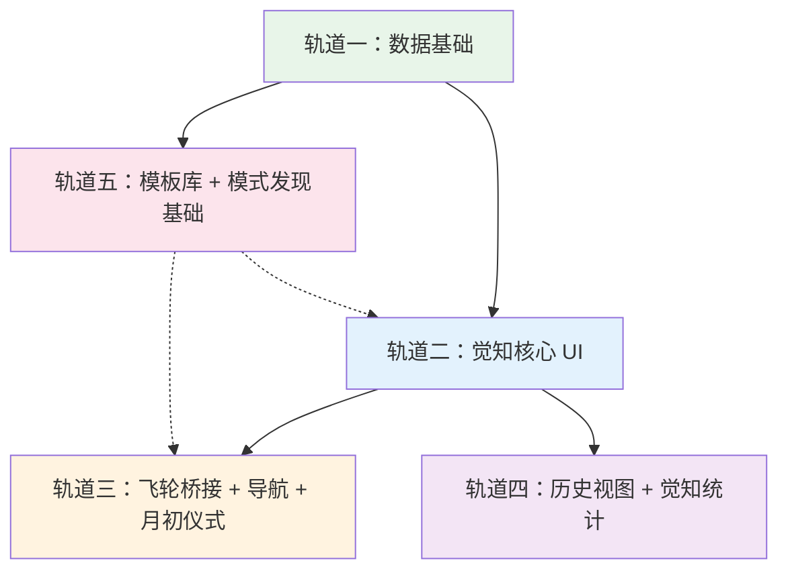

# 总体计划：V3 觉知伴侣

## 项目概述

### 项目背景

Hachimi v2.x 是一个「养猫 + 专注计时」的习惯打卡工具。用梁宁《真需求》的语言：这是一个「功能价值」产品——市场上 Finch、Habitica、Forest 都能做到。猫咪有情绪价值的潜力，但目前停留在「装饰」层面。

**根本缺口**：

| 维度 | v2.x 现状 | V3 补全 |
|------|----------|---------|
| 功能价值 | 习惯打卡 + 专注计时 ✅ | ⬜ 习惯设计引导 |
| 情绪价值·保障感 | 几乎没有 | ✅ 烦恼减负（焦虑外化） |
| 情绪价值·愉悦感 | 猫咪浅层陪伴 | ✅ 每日一点光 + 模式发现 |
| 情绪价值·彰显性 | 无 | ✅ 成长历程可视化 |
| 资产价值 | 无 | ✅ 个人觉知档案 |

### V3 定位

> **Hachimi 是一个帮你在每天 5 分钟里「觉知自己」的数字伴侣。**
>
> 猫咪不再只是习惯追踪的奖励机制，而是你内心宇宙里陪你一起成长的生命。

### 产品飞轮（三层融合）

```
                    ┌─────────────────┐
                    │   专注计时       │  ← Forest 式计时，习惯成长燃料
                    │  （行为催化剂）   │
                    └────────┬────────┘
                             │ 完成触发
                    ┌────────▼────────┐
                    │   觉知记录       │  ← 每日一点光 + 周回顾 + 烦恼处理
                    │  （意义赋予层）   │
                    └────────┬────────┘
                             │ 反应驱动
                    ┌────────▼────────┐
                    │   猫咪伴侣       │  ← 心情感应 + 模板反馈
                    │  （情感连接载体） │
                    └─────────────────┘
```

### 三幕结构

| 幕 | 场景 | 触发时机 | 时长 | 核心交互 |
|----|------|---------|------|---------|
| 第一幕 | 睡前一点光 | 每晚（用户设定时间） | ~30 秒 | 选心情 + 写一句话 |
| 第二幕 | 周日复盘 | 每周（周日提醒，随时可做） | ~5 分钟 | 三个幸福时刻 + 感恩 + 学习 + 烦恼更新 |
| 第三幕 | 月初仪式 | 每月 1 日 | ~2 分钟 | 选一个重点习惯 + 设定灵活目标 + 奖励承诺 |

---

## 设计决策汇总

### 产品决策（与 PRD 原文的差异）

| 决策 | PRD 原方案 | 最终方案 | 理由 |
|------|-----------|---------|------|
| 月初仪式时间 | 轨道四（v2.36.0） | **提前到 v2.35.0** | 梁宁「没有强场景就是爬虫子」，三幕必须同时上线 |
| 成就基准 | 连续天数 | **累计天数** | 消除 streak anxiety，与「不完美也没关系」一致 |
| 记录频率 | 鼓励每日 | **鼓励每日、不强制** | 文案引导「什么时候都可以来」，低门槛缓解享乐适应 |
| AI 依赖 | AI 周总结 + 模式发现 | **MVP 零 AI 依赖** | 用预生成模板库替代，彻底离线优先 |
| 猫咪架构 | 多猫 | **V3 保持现有多猫，V3.1 单独做单猫重构** | 避免两个大重构交织 |
| 猫咪视觉 | 需要重构 | **V3 继续用现有 PixelCatSprite** | 觉知功能优先，视觉重构延后 |
| 猫咪反应触发 | 多场景 | **仅一点光保存后** | 「少即是多」，太频繁贬值 |
| 预设标签 | 10 个 | **5 个核心**（家人/朋友/学习/户外/工作） | 标签越少用户越可能使用 |
| 月度目标 | 30 天固定 | **灵活目标，默认 20/30** | 与「不完美也没关系」一致 |
| 周定义 | 未明确 | **ISO：周一开始，周日是本周最后一天** | 符合「周末=结束」直觉 |
| 周回顾时间 | 周日 | **随时可做，周日提醒** | 「不一定在周日做也没关系」 |
| 召回通知 | 每周最多 1 次 | **每两周最多 1 次** | 降低操纵感 |

### 技术决策

| 决策 | 最终方案 |
|------|---------|
| WeeklyReview 幸福时刻 | 3 个独立字段（不用 List，SQLite 存储更简单） |
| DailyLight 可选字段 | 模型保留 timelineEvents/habitCompletions，UI 延后到轨道四 |
| L10n | 仅 EN + ZH-CN，其他 13 种语言英文回退 |
| 主题兼容 | 双主题全支持（Material 3 + Retro Pixel） |
| 测试策略 | 模型单元测试 + 真机手动测试 |
| 模板库架构 | 常量文件 + 占位符替换 |
| 快速录入模式 | 仅 Mood + 一句话（无标签、无时间轴） |
| 首页空状态 | 温暖提示卡 + 快捷入口 |
| 烦恼处理器入口 | 独立入口 + 周回顾中也可更新 |
| 子 Tab 标签 | 今天 / 本周 / 回顾 |
| 今日 Tab 内容 | 一点光状态 + 月度挑战 + 习惯快速勾选 |

---

## 依赖关系图



> 虚线表示轨道五的模板库被轨道二和三使用（猫咪反应文案），但模板库可以先用少量种子数据启动，后续扩充。

---

## 版本映射

| 版本 | 包含轨道 | 交付内容 | 标签 |
|------|---------|---------|------|
| **v2.35.0** | 轨道一 + 二 + 三 + 五（种子） | 觉知飞轮核心闭环可端到端演示 | 首次可发布 |
| **v2.36.0** | 轨道四 | 历史视图 + 月度统计 + TimelineEditor | 增强回顾体验 |
| **v2.37.0** | 轨道五（完整） | 模板库扩充 + 本地标签分析 + 成长洞察卡 | 数据驱动觉知 |

---

## SSOT 文档更新清单

> DDD 原则：编码前必须先更新文档。

| 优先级 | 文件 | 改动内容 | 更新时机 |
|--------|------|---------|---------|
| 1 | `docs/architecture/data-model.md` | 新增 4 张 SQLite 表完整 schema + 3 个 Firestore 集合 | 轨道一开始前 |
| 2 | `docs/architecture/state-management.md` | 新增 awareness/worry providers + 新 ActionType 值 | 轨道一开始前 |
| 3 | `docs/architecture/folder-structure.md` | 新增 `screens/awareness/`（5 文件）+ `widgets/awareness/`（7 文件） | 轨道二开始前 |
| 4 | `docs/design/screens.md` | 新增 7 个屏幕布局规格 | 轨道二开始前 |
| 5 | `docs/architecture/cat-system.md` | 猫咪心情感应反应表（5 心情 × 反应描述） | 轨道二开始前 |
| 6 | `lib/core/constants/analytics_events.dart` | 4 个新事件名 | 轨道三开始前 |
| — | 所有对应 `docs/zh-CN/` 镜像 | 同步更新 | 与英文版同时 |

---

## 全局导航结构

```
底部 Tab（左→右）：
┌──────────────────────────────────────────┐
│  ✨觉知  │  📋习惯  │  🐱猫咪  │  👤我的  │
└──────────────────────────────────────────┘

觉知 Tab 内部子 Tab：
┌──────────────────────────┐
│  今天  │  本周  │  回顾  │
└──────────────────────────┘
```

| Tab | 屏幕 | 内容 |
|-----|------|------|
| ✨ 觉知 | `AwarenessScreen` | 默认打开，三个子 Tab |
| 📋 习惯 | `TodayTab`（原 Tab 0） | 今日习惯列表 + 快速打卡 + 专注计时入口 |
| 🐱 猫咪 | `CatRoomScreen` | 猫舍（保持现有多猫，V3.1 改单猫） |
| 👤 我的 | `ProfileScreen` | 用户信息 + 成就 + 统计 + 设置 + 签到日历 |

---

## 任务分解树

```
V3 觉知伴侣
├── 轨道一：数据基础（plan_02）
│   ├── SSOT 文档更新（data-model.md + state-management.md）
│   ├── Dart 模型：Mood + DailyLight + WeeklyReview + Worry
│   ├── SQLite migration（4 张新表）
│   ├── AwarenessRepository + WorryRepository
│   ├── Riverpod providers（9 个新 provider）
│   ├── SyncEngine 更新（3 个 Firestore 集合）
│   ├── Firestore 规则更新
│   └── 模型单元测试
│
├── 轨道二：觉知核心 UI（plan_03）
│   ├── SSOT 文档更新（folder-structure.md + screens.md）
│   ├── Widget：MoodSelector + LightInputCard + TagSelector
│   ├── Widget：HappyMomentCard + WorryItemCard
│   ├── Widget：CatBedtimeAnimation + AwarenessEmptyState
│   ├── Screen：AwarenessScreen（3 子 Tab）
│   ├── Screen：DailyLightScreen（含 quickMode）
│   ├── Screen：WeeklyReviewScreen
│   ├── Screen：WorryProcessorScreen + WorryEditScreen
│   ├── 路由注册（7 个新路由）
│   └── L10n 新增 key（~50 个，EN + ZH-CN）
│
├── 轨道三：飞轮桥接 + 导航 + 月初仪式（plan_04）
│   ├── HomeScreen Tab 重组（3→4 Tab）
│   ├── FocusCompleteScreen 桥接 Banner
│   ├── MonthlyRitualCard widget
│   ├── 8 个觉知成就（累计制）
│   ├── 4 种通知调度
│   ├── 4 个 Analytics 事件
│   ├── Onboarding 文案更新
│   └── L10n 新增 key（~40 个）
│
├── 轨道四：历史视图 + 觉知统计（plan_05）
│   ├── MoodCalendar widget
│   ├── AwarenessHistoryScreen
│   ├── DailyDetailScreen
│   ├── AwarenessStatsCard（嵌入 ProfileScreen）
│   ├── TimelineEditor widget（可选）
│   └── L10n 新增 key（~15 个）
│
└── 轨道五：模板库 + 模式发现基础（plan_06）
    ├── cat_response_templates.dart（~100-150 条模板）
    ├── getRandomResponse() 函数
    ├── 标签频率分析（本地计算）
    ├── GrowthInsightCard（CatDetailScreen）
    └── L10n 新增 key（~15 个）
```

---

## 质量门禁

### 每次合并到 main 前必须全部通过

```bash
dart analyze lib/                              # 零 warning / error
flutter test test/models/                      # 模型单元测试全绿
dart format lib/ test/ --set-exit-if-changed   # 零格式问题
```

### 手动验证（真机）

- 完整觉知飞轮端到端：专注 → Banner → 一点光 → 猫咪模板反应
- 周回顾完整流程：填写 → 保存 → 模板周总结显示
- 月初仪式：设定目标 → 30 天网格正确渲染
- 烦恼处理器 CRUD：新建 → 编辑 → 标记解决/消失
- 双主题：Material 3 和 Retro Pixel 下所有新屏幕正确渲染

---

## Git 分支策略

```
main
  └── feat/v3-awareness          ← V3 主开发分支
```

无需子分支（独立开发者，无并行开发冲突风险）。所有轨道在 `feat/v3-awareness` 上顺序开发，完成后 PR 合并回 main。

**操作命令**：
```bash
git checkout main && git pull
git checkout -b feat/v3-awareness
git push -u origin feat/v3-awareness
```

---

## 风险评估

| 风险 | 影响 | 缓解措施 |
|------|------|---------|
| HomeScreen Tab 重组 blast radius | 所有导航流程受影响 | 轨道三最后做，前两个轨道完全稳定后再动 |
| SQLite migration 失败 | 数据丢失 | 无真实用户，可清数据库重建 |
| 模板库文案质量 | 用户感受重复 | 每场景准备 10-20 条，包含占位符动态化 |
| 双主题兼容 | Retro Pixel 下新组件显示异常 | 使用 Theme.of(context) 而非硬编码颜色 |

---

## 项目统计

- **总计划文件**：6 个
- **2 级任务（轨道）**：5 个
- **新增文件（预估）**：~20 个
- **修改文件（预估）**：~15 个
- **新增 L10n key**：~120 个（EN + ZH-CN）
- **新增模板文案**：~100-150 条
